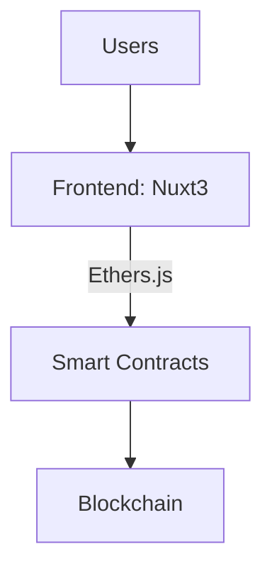

<div align="center">
  
</div>

# 🚀 StakeHive — Enterprise-Grade DeFi Staking Protocol

---

## 🔥 Live Demo

Explore the app live here:
[https://stakehive-defi-dapp.netlify.app/](https://stakehive-defi-dapp.netlify.app/)

StakeHive is a decentralized finance (DeFi) app enabling users to stake custom HIVE tokens, earn rewards, claim, withdraw, and transfer tokens securely on the blockchain.

How to Use StakeHive
Want to start staking with StakeHive? Follow these simple steps:

## 🔹 Step 1: Enable Test Networks in MetaMask

By default, MetaMask hides test networks. To enable them:

Open MetaMask.

Click on your account icon → Settings.

Navigate to Advanced.

Scroll to "Show test networks" and toggle it ON.

Close settings, and you'll now see "Sepolia" in the network dropdown.

## 🔹 Step 2: Add Sepolia Testnet (If Not Visible)

If Sepolia is still not showing, you can manually add it:

Click "Select Network" > “Add network” > “Add network manually”.

Fill in:

yaml

`Network Name: Sepolia Test Network
RPC URL: https://rpc.sepolia.org
Chain ID: 11155111
Currency Symbol: ETH
Block Explorer URL: https://sepolia.etherscan.io`

Click Save.

## 🔹 Step 3: Get Sepolia ETH for Gas

You need Sepolia ETH to pay for gas on the blockchain. Use a testnet faucet:

🔗 Alchemy Sepolia Faucet

🔗 Chainlink Faucet

Paste your MetaMask address and request tokens (limit once every 24 hours).

## 🔹 Step 4: Add HIVE Token to MetaMask

MetaMask does not automatically show custom tokens. To add the HIVE token:

In MetaMask, click "Assets" > "Import tokens".

Use your deployed token address (from deploy.js script or from Etherscan).

Enter the token details:

Token Contract Address: 0xBA6D102E57Bda979B68BC4c0c47980CeBeF9075b

Token Symbol: HIVE

Decimals: 18

Click Add Custom Token.

Now you’ll see your HIVE balance!

## 🔹 Step 5: Connect Wallet to StakeHive dApp

Visit: https://stakehive-defi-dapp.netlify.app

Click "Connect Wallet" (top-right).

Select MetaMask or another preferred wallet (via Web3Modal).

🔁 Core Features: How to Use
✅ Stake HIVE Tokens
Make sure you have HIVE tokens in your wallet.

Go to the Stake section.

Enter the amount of HIVE to stake.

Click “Stake”, confirm in MetaMask.

Your tokens are now locked and earning rewards.

## 💸 Claim Rewards

Head to the Rewards tab.

Click “Claim” to collect earned rewards.

Confirm the transaction in MetaMask.

Claimed tokens go directly to your wallet.

## 🔄 Withdraw Staked Tokens

You can only withdraw after the lock period ends.

Go to Staked Balance.

Click “Withdraw”.

Confirm the transaction.

Tokens will return to your wallet.

## 🔁 Transfer HIVE Tokens

Navigate to the Transfer tab.

Enter a recipient wallet address.

Specify the amount to transfer.

Click “Send” → Confirm in MetaMask.

Transaction is confirmed on-chain, tokens reflect instantly.

## 🎯 Pro Tips

Use Sepolia ETH only for test purposes — it holds no real value.

Check all transactions on Sepolia Etherscan.

If you don’t see your tokens in MetaMask after a transaction, click "Import Tokens" and re-enter the HIVE token address.

---

## ✨ Key Features

| Feature            | Description                                                             | Tech Used               |
| ------------------ | ----------------------------------------------------------------------- | ----------------------- |
| Custom ERC20 Token | `HIVE` token with minting and burning functionality                     | Solidity, OpenZeppelin  |
| Staking Contract   | Time-locked staking with secure rewards distribution                    | Solidity, Hardhat       |
| Token Transfer     | Transfer HIVE tokens between accounts with blockchain verification      | Ethers.js, MetaMask     |
| Real-Time Updates  | Reactive UI reflecting live balances, rewards, and transaction statuses | Vue 3, Nuxt 3, Tailwind |
| Wallet Integration | Supports MetaMask, WalletConnect, and Coinbase Wallet                   | Web3Modal               |
| Responsive UI      | Mobile and desktop friendly dashboard with staking analytics and charts | Tailwind CSS, Chart.js  |

---

## 🏗️ Architecture Overview

Here’s a simplified view of the StakeHive architecture — how components connect and communicate:



---

## 🛠️ Technology Stack

### Smart Contracts

- **Language**: Solidity (v0.8+)
- **Frameworks**: Hardhat for development, testing, and deployment
- **Testing**: Mocha, Chai, and Slither static analysis for security checks
- **Network**: Deployed on Sepolia Testnet (Etherscan verified)

### Frontend

- **Framework**: Nuxt 3 with Composition API (Vue 3)
- **Blockchain**: Ethers.js v6 for smart contract interaction
- **Wallets**: MetaMask, WalletConnect, Coinbase Wallet through Web3Modal
- **Styling**: Tailwind CSS + DaisyUI for rapid, responsive UI development
- **Charts & Analytics**: Chart.js for staking and reward visuals
- **Deployment**: Hosted on Netlify

---

## 📦 Getting Started

Follow these steps to run the project locally and test your own deployment:

```bash
# 1. Clone the repo
git clone https://github.com/Darahat/stakehive-dapp.git
cd stakehive-dapp

# 2. Install dependencies for backend and frontend
npm install
cd frontend && npm install

# 3. Setup environment variables
cp .env.example .env
# Edit .env with your Sepolia RPC URL and wallet PRIVATE_KEY

# 4. Start the local blockchain and deploy contracts
npx hardhat node &
npx hardhat run scripts/deploy.js --network localhost

# 5. Run the frontend
cd frontend
npm run dev
```

---

## 🔍 Usage Notes

- **Wallet Connection**: MetaMask or compatible wallets are required. If MetaMask is not detected, the app prompts with a styled popup to install it.
- **Token Balances**: The HIVE token balance is shown dynamically, fetched from the blockchain.
- **Staking Limits**: The amount you can stake is limited by your current HIVE token balance.
- **Gas Fees**: The app is optimized for gas efficiency but you will still need testnet ETH for transactions.
- **Token Transfer**: Transfers are peer-to-peer and verified on-chain; tokens sent will reflect on the recipient's wallet.
- **Real-Time UI**: Vue watchers ensure balances, rewards, and staking statuses update automatically without manual refresh.

---

## 📊 Performance Highlights

| Metric               | Value                |
| -------------------- | -------------------- |
| Contract Size        | \~24.5 KB            |
| Average Gas Cost     | \~142,000 gas        |
| Transactions Per Sec | \~18.7 TPS (testnet) |
| Frontend Load Time   | \~1.2 seconds        |

---

## ⚠️ Common Issues & Debugging Tips

- **"Unknown Token" in MetaMask**: You must manually add the HIVE token contract address in MetaMask to see the token and balance.
- **Transaction Failures**: Check that you have enough test ETH for gas and the correct amount of HIVE tokens approved.
- **BigNumber Issues**: Always convert inputs and amounts properly using `ethers.parseUnits(value, 18)` for token decimals.
- **Wallet Not Detected**: The app shows a friendly prompt to install MetaMask with a helpful link.
- **Error Handling**: All blockchain transactions are wrapped in try/catch with user-friendly status messages.

---

## 👨‍💻 Developer Notes

- This app uses **Ethers.js v6** — syntax differs from v5 (especially `parseEther` and contract calls).
- Smart contracts include reentrancy guards and gas optimizations.
- Vue 3 Composition API provides modular and reactive state management with watchers for blockchain state.
- The frontend automatically updates staking and rewards info on wallet events.
- The backend admin panel (Laravel) manages off-chain data and analytics (not included in this repo).

---

## 📬 Contact & Collaboration

**Didarul Alam Rahat**
Senior Full Stack & Web3 Developer

- 🔗 [LinkedIn](https://linkedin.com/in/darahat)
- 📧 [darahat42@gmail.com](mailto:darahat42@gmail.com)
- 🐦 [@darahat42](https://twitter.com/darahat42)

_Open to senior Web3 roles, audits, consulting, and collaborations._

---

## 📜 License

MIT License © 2023 Didarul Alam Rahat

---

Feel free to open issues or submit pull requests to improve the project! Your feedback and contributions are welcome.

---

**Happy BUIDLing!** 🚀🐝

---
